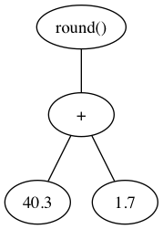

# Happy little macros

Peter Williams
pezra@barelyenough.org

---

anyone can create beautifully clear code

---

```elixir
before_ms = :erlang.monotonic_time(:millisecond)
:timer.sleep(:rand.uniform(100))
after_ms = :erlang.monotonic_time(:millisecond)
elapsed = after_ms - before_ms
Logger.info("doing important stuff (#{elapsed}ms)")
```
@[2]
@[1, 3-5](boilerplate sucks!)

14:25:06.869 [info]  doing important stuff (46ms)

Notes: The boilerplate hides the intent of this block of code
---

let's have a happy little macro that makes our intent clear

---

```elixir
benchmark("doing important stuff") do
  :timer.sleep(:rand.uniform(100))
end
```

14:25:06.869 [info]  doing important stuff (46ms)

Notes: The intent of this version is clear.
---

```elixir
defmacro benchmark(msg, blk) do
  quote do
    before_ms = :erlang.monotonic_time(:millisecond)
    unquote(blk)
    after_ms = :erlang.monotonic_time(:millisecond)
    elapsed = after_ms - before_ms
    Logger.info(unquote(msg) <> " (#{elapsed}ms)")
  end
end
```

@[3, 5-7] the boilerplate from the previous example
@[4] execute it do block passed in

Notes: In this context all that time and logging code is the important part, *not* boilerplate.

---

how does that work?

Notes: Let's start by exploring some toy examples.

---

AST = abstract syntax tree

Notes: define the word i'm going to be using a lot

---



---

```elixir
iex>  quote do: "hello"
"hello"
```

```elixir
iex>  quote do: 42
42
```

Notes: `quote` returns the AST representation of the code you pass it. For literals it's just the literal.

---

```elixir
iex>  quote do: 3 + 1
{:+, [context: Elixir, import: Kernel], [3, 2]}
```

Notes: `quote` returns the AST representation of the code you pass it. For operators it gets a little more complicated.

---

```elixir
iex> x = 3
...> quote do: unquote(x)
3
```

Note: `unquote` returns the AST of a value outside the quote.

---


```elixir
iex> a = 3
...> quote do: unquote(a + 2)
5
```

Note: To be more precise. `unquote` evaluates the expressions you pass in the context outside the `quote` block and returns the AST representation of that expression's return value.

---


----

Back to our benchmarking example

---

```elixir
benchmark("Doing important stuff") do
  :timer.sleep(:rand.uniform(100))
end
```

---

```elixir
{:__block__, [],
 [{:=, [],
   [{:before_ms, [], Benchmarking},
    {{:., [], [:erlang, :monotonic_time]}, [], [:millisecond]}]},
  [do: {{:., [line: 34], [:timer, :sleep]}, [line: 34],
    [{{:., [line: 34], [:rand, :uniform]}, [line: 34], 'd'}]}],
  {:=, [],
   [{:after_ms, [], Benchmarking},
    {{:., [], [:erlang, :monotonic_time]}, [], [:millisecond]}]},
  {:=, [],
   [{:elapsed, [], Benchmarking},
    {:-, [context: Benchmarking, import: Kernel],
     [{:after_ms, [], Benchmarking},
      {:before_ms, [], Benchmarking}]}]},
  {{:., [],
    [{:__aliases__, [alias: false], [:Logger]}, :info]},
   [],
   [{:<>, [context: Benchmarking, import: Kernel],
     ["Doing important stuff",
      {:<<>>, [],
       [" (",
        {:::, [],
         [{{:., [], [Kernel, :to_string]}, [],
           [{:elapsed, [], Benchmarking}]},
          {:binary, [], Benchmarking}]}, "ms)"]}]}]}]}
```

@[2-4](before_ms = :erlang.monotonic_time(:millisecond))
@[5-6](... do :timer.sleep(:rand.uniform(100)) end)
@[7-9](after_ms = :erlang.monotonic_time(:millisecond))
@[10-14](elapsed = after_ms - before_ms)
@[15-25](Logger.info(unquote(msg) <> " (#{elapsed}ms)"))

---


